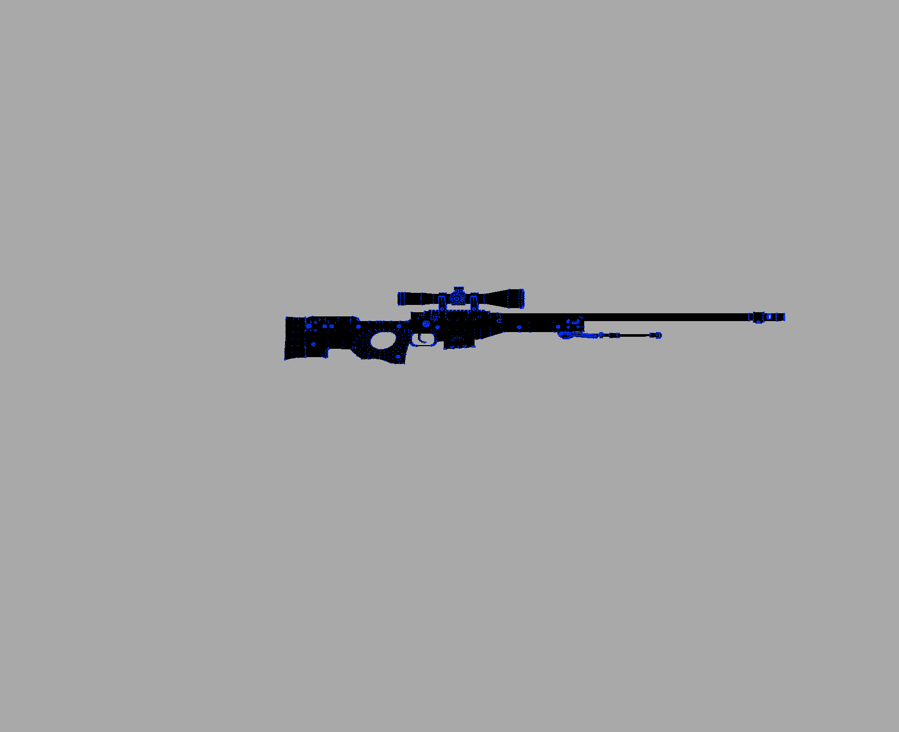

# 3DViewer v2.1.

## Основная информация

---

Проект 3DViewer v2.1 является доработкой проекта 3DViewer2.0.
Основное отличие от предыдущей версии проекта в том, что теперь доступен просмотр модели
не только в каркасной форме, но и с возможностью наложить текстуру на модель (если таковая поддерживает это).

---

Кнопка отвечающая за импорт находится справа во вкладке <b>Import</b> и имеет название <b>Wavefront (.obj) (legacy)</b>. Либо сочетание клавиш <b>Shift + I</b>.\
Кнопка отвечающая за импорт текстуры также находится во вкладке <b>Import</b> и имеет название <b>Load Texture</b>. Либо сочетание клавиш <b>Shift + T</b>.

---

## Управление параметрами отрисовки

---

Управление параметрами отрисовки находится во вкладке <b>Scene Settings</b>.\
Есть возможность изменить отображаемую проекцию, перейти от каркасной модели к текстуре (если она загружена) нажав кнопку <b>Texture Overlay</b> и убрать текстуру, перейдя к каркасной модели, нажав кнопку <b>Reset Texture</b> <b>Горячая клавиша Shift + R</b>.\
Есть возможность выбрать примитив отрисовки для каркасной модели

---

## Запись сцены

---

В этой вкладке есть возможность сделать скриншот сцены нажав <b>Record Image</b>.\
Также есть два типа записи анимации в (.gif) формат:\
    1) Запись движений пользователя (кнопка <b>Record Animation</b>) - после нажатия кнопки у вас будет 5 секунд для произвольной работы с моделью.\
    2) Запись статической анимации (кнопка <b>Record Static Animation</b>) - для того чтобы не испортить статическую анимацию, просим вас не мешать программе в процессе записи анимации.\

---

## Трансформация объекта

---

Вкладка <b>Rotation</b> отвечает за вращение объекта по всем трем осям
 
Вкладка <b>Location</b> отвечает за расположение объекта по всем трем осям
 
Вкладка <b>Scale</b> отвечает за размер объекта

---

## Усправление освещением

---

Управление освещением осуществляется через вкладку <b>Light</b>
 
Есть возможность установить расположение света в пространстве по всем трем осям
 
Есть возможность установить базовый цвет источника света
 
Есть возможность выбрать одно из трех методов тонирования, <b>Плоское, Гуро, Фонга</b>

---

## Усправление параметрами объекта

---

Усправление параметрами объекта осуществляется через вкладку <b>Object Settings</b>
 
Есть возможность установить толщину линий, цвет линий, тип линий
 
Есть возможность установить размер точек, цвет точек, тип точек
 
Есть возможность задать цвет заднего фона

---

## Превью работоспособности

---

